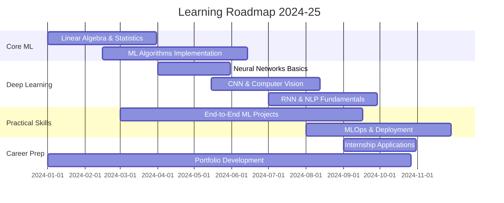

<div align="center">

# Vivek Vishwakarma
### 🎓 B.Tech Student | Aspiring AI/ML Engineer
*Learning and building intelligent solutions for the future*

[](https://yourportfolio.com)
[](https://linkedin.com/in/vivekv)
[](https://kaggle.com/vivekv)
[](mailto:vivek@example.com)


[](https://github.com/yourusername)

</div>

---

## 🎯 Student Profile & Learning Journey

```python
class StudentAIMLEngineer:
    def __init__(self):
        self.name = "Vivek Vishwakarma"
        self.status = "B.Tech Computer Science Student"
        self.year = "3rd Year (2021-2025)"
        self.passion = "AI/ML & Data Science"
        self.goal = "Becoming a skilled AI/ML Engineer"
        
    def current_learning(self):
        return {
            "core_subjects": ["Data Structures", "Algorithms", "DBMS", "OS"],
            "ai_ml_focus": ["Machine Learning", "Deep Learning", "Python", "Statistics"],
            "practical_skills": ["TensorFlow", "PyTorch", "Pandas", "NumPy"],
            "projects_completed": 8,
            "kaggle_rank": "Contributor"
        }
        
    def career_vision(self):
        return "Building AI systems that make a positive impact on society"
```

<table>
<tr>
<td width="50%">

**📚 Currently Learning**
- 🧠 Machine Learning Algorithms
- 🔥 Deep Learning with Neural Networks
- 👁️ Computer Vision basics
- 📊 Data Analysis & Visualization
- 🐍 Advanced Python Programming
- 📈 Statistics & Probability

</td>
<td width="50%">

**🎯 Academic Goals**
- 📝 Complete 15+ AI/ML projects
- 🏆 Participate in Kaggle competitions
- 📖 Maintain 8.5+ CGPA
- 💼 Secure AI/ML internship
- 🌟 Contribute to open-source projects
- 📚 Build strong foundation in mathematics

</td>
</tr>
</table>

---

## 🛠️ Tech Stack & Tools I'm Learning

<div align="center">

### **Programming Languages**


### **AI/ML Libraries & Frameworks**


### **Data Science & Analysis**


### **Databases & Tools**


### **Currently Exploring**


</div>

---

## 🚀 Student Projects & Learning Portfolio

<div align="center">

### 🎯 **Academic & Personal Projects**

</div>

<table>
<tr>
<td width="50%">

### 🤖 **Movie Recommendation System**
*Collaborative filtering ML model*

**🔧 Tech Stack:** `Python` `Pandas` `Scikit-learn` `Streamlit`

**📚 Learning Outcomes:**
- Collaborative & Content-based filtering
- Data preprocessing techniques
- Model evaluation metrics
- Web app deployment

**📊 Results:** 85% accuracy, 200+ movie dataset

[](https://demo-link.com)
[](https://github.com/yourusername/repo)
[](https://yourblog.com)

</td>
<td width="50%">

### 📊 **COVID-19 Data Analysis**
*Exploratory data analysis and visualization*

**🔧 Tech Stack:** `Python` `Pandas` `Matplotlib` `Seaborn` `Plotly`

**📚 Learning Outcomes:**
- Data cleaning and preprocessing  
- Statistical analysis techniques
- Interactive visualizations
- Time series analysis basics

**📊 Results:** 10+ insights, interactive dashboard

[](https://demo-link.com)
[](https://github.com/yourusername/repo)
[](https://kaggle.com/yournotebook)

</td>
</tr>
<tr>
<td width="50%">

### 🎭 **Emotion Detection from Text**
*NLP project using sentiment analysis*

**🔧 Tech Stack:** `Python` `NLTK` `TensorFlow` `Flask`

**📚 Learning Outcomes:**
- Natural Language Processing
- Text preprocessing techniques
- Neural network implementation
- API development basics

**📊 Results:** 78% accuracy on test data

[](https://demo-link.com)
[](https://github.com/yourusername/repo)

</td>
<td width="50%">

### 🏠 **House Price Prediction**
*Regression model for real estate data*

**🔧 Tech Stack:** `Python` `Scikit-learn` `XGBoost` `Jupyter`

**📚 Learning Outcomes:**
- Linear & polynomial regression
- Feature engineering techniques
- Cross-validation methods
- Model comparison & selection

**📊 Results:** R² score: 0.87, RMSE: 15,230

[](https://demo-link.com)
[](https://github.com/yourusername/repo)

</td>
</tr>
</table>

---

## 📈 GitHub Stats & Coding Journey

<div align="center">


### 🔥 **Learning Progress**


</div>

---

## 🎓 Academic Journey & Achievements

<div align="center">

<table>
<tr>
<td width="33%">

### 📚 **Academic Info**
**B.Tech Computer Science**  
*XYZ Institute of Technology*  
📅 2021 - 2025  
📊 Current CGPA: 8.2/10

**Core Subjects:**
- Data Structures & Algorithms ✅
- Database Management Systems ✅  
- Operating Systems ✅
- Computer Networks 📚
- Machine Learning 📚

</td>
<td width="33%">

### 🏆 **Online Certifications**
[](https://coursera.org)  
[](https://coursera.org)  
[](https://hackerrank.com)  
[](https://kaggle.com)

**In Progress:**
- Deep Learning Specialization
- AWS Cloud Practitioner

</td>
<td width="33%">

### 🌟 **Achievements**
**Academic:**
- Dean's List (Semester 4)
- Best Project Award (DBMS)
- Coding Competition Winner

**Online Platforms:**
- Kaggle Contributor (Bronze)
- HackerRank 4⭐ (Python)
- LeetCode 200+ problems solved
- GeeksforGeeks 500+ points

</td>
</tr>
</table>

</div>

---

## 📚 Current Learning Path & Goals

<div align="center">



</div>

### 🎯 **Current Learning Focus (2024)**
- 📖 **Mathematics for ML**: Linear Algebra, Statistics, Calculus
- 🤖 **Deep Learning**: Neural Networks, CNNs, RNNs
- 🔧 **MLOps Basics**: Git, Docker, Cloud platforms
- 📊 **Advanced Data Analysis**: Time series, A/B testing
- 💻 **System Design**: Building scalable ML applications

### ✅ **2024 Learning Goals**
- [ ] Complete Andrew Ng's Machine Learning Course
- [ ] Build 5 end-to-end ML projects
- [ ] Achieve Kaggle Expert status
- [ ] Learn Docker and basic AWS
- [ ] Contribute to 3 open-source ML projects
- [ ] Write 10 technical blog posts
- [ ] Secure summer internship in AI/ML
- [ ] Maintain 8.5+ CGPA

---

## 🌟 Skills Development Journey

<div align="center">

### 📊 **Current Skill Levels**

| **Skill Area** | **Proficiency** | **Projects** | **Next Steps** |
|:---|:---:|:---:|:---|
| **Python Programming** | 🟢🟢🟢🟢⚪ | 15+ | Advanced OOP, Design Patterns |
| **Machine Learning** | 🟢🟢🟢⚪⚪ | 8 | Ensemble methods, Feature engineering |
| **Data Analysis** | 🟢🟢🟢🟢⚪ | 10+ | Time series, Advanced statistics |
| **Deep Learning** | 🟢🟢⚪⚪⚪ | 3 | CNNs, RNNs, Transfer learning |
| **Web Development** | 🟢🟢🟢⚪⚪ | 5 | Full-stack, API development |
| **SQL & Databases** | 🟢🟢🟢⚪⚪ | 6 | Advanced queries, NoSQL |

</div>

---

## 🤝 Looking for Opportunities

<div align="center">

**🚀 Actively seeking learning opportunities and connections in AI/ML field!**

[](https://yourportfolio.com)
[](https://linkedin.com/in/vivekv)
[](https://kaggle.com/vivekv)
[](https://yourresume.pdf)
[](mailto:vivek.student@example.com)
